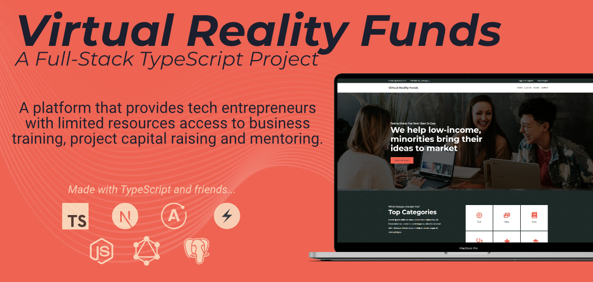

<a name="readme-top"></a>

<!-- PROJECT SHIELDS -->
<!--
*** I'm using markdown "reference style" links for readability.
*** Reference links are enclosed in brackets [ ] instead of parentheses ( ).
*** See the bottom of this document for the declaration of the reference variables
*** for contributors-url, forks-url, etc. This is an optional, concise syntax you may use.
*** https://www.markdownguide.org/basic-syntax/#reference-style-links
-->

<!-- PROJECT LOGO -->
<br />
<div align="center">
  <a href="https://github.com/markanator/fullstack-vr-funding">
    
  </a>

<h2 align="center">Angel Funds</h1>

  <p align="center">
    A platform that provides tech entrepreneurs with limited resources access to project capital raising.
    <br />
    <br />
    <a href="https://vr-funds.markambrocio.com/">View Site</a>
    ·
    <a href="https://github.com/markanator/fullstack-vr-funding/issues">Report Bug</a>
  </p>
</div>

<!-- TABLE OF CONTENTS -->
<details>
  <summary>Table of Contents</summary>
  <ol>
    <li>
      <a href="#about-the-project">About The Project</a>
      <ul>
        <li><a href="#built-with">Built With</a></li>
      </ul>
    </li>
    <li>
      <a href="#getting-started">Getting Started</a>
      <ul>
        <li><a href="#prerequisites">Prerequisites</a></li>
        <li><a href="#installation">Installation</a></li>
      </ul>
    </li>
    <li><a href="#usage">Usage</a></li>
    <li><a href="#roadmap">Roadmap</a></li>
    <li><a href="#contributing">Contributing</a></li>
    <li><a href="#license">License</a></li>
    <li><a href="#contact">Contact</a></li>
    <li><a href="#acknowledgments">Acknowledgments</a></li>
  </ol>
</details>

<!-- ABOUT THE PROJECT -->

## Background

<!-- [![Product Name Screen Shot][product-screenshot]](https://example.com) -->

During my time as a coding bootcamp student, I was often given monthly challenges to work as a team (of varying-in-experience, cross functional developers) to build and deploy small MVP web application.

As is the case with rushed software, the end result or MVP was operational, but not visually appealing. Towards the end of my time at the Bootcamp I found myself wanting to learn more and become "job ready" so that I could hit the ground running. I challenged myself to remake certain projects front to back, solo.

Although I was not given this topic "Virtual Reality Funds", I challenged myself to give it a shot, as I am really into VR and games. I stumbled upon a youtube video by Ben Awad titled: ["Fullstack React GraphQL TypeScript Tutorial (14hrs)"](https://www.youtube.com/watch?v=I6ypD7qv3Z8), which I coded along to and deployed. I wanted to cement my learning, so what better way than to create something. This is the results.

<p align="right">(<a href="#readme-top">back to top</a>)</p>

<!-- GETTING STARTED -->

## Local Development

To develop this project locally, follow the steps below.

### Prerequisites

This is an example of how to list things you need to use the software and how to install them.

- Node >= v16.x.x
- Yarn v1

### Installation

1. Create a free Stripe Account and generate an API Key and Publishable Key at [https://stripe.com](https://stripe.com/)
2. Clone the repo
   ```sh
   git clone https://github.com/markanator/fullstack-vr-funding.git
   ```
3. Install NPM packages on client and backend
   ```sh
   cd client/ && yarn install
   cd backend/ && yarn install
   ```
4. Create .env files for both client and backend using copy
   ```sh
    	cd client/ && cp .example.env .env
    	cd backend/ && cp .example.env .env
   ```
5. Enter the respective credentials to the .env files
6. Running the backend locally is a two step procedure
   ```sh
   cd backend/
   yarn watch && yarn dev
   ```
7. Run the client locally
   ```sh
   cd client/
   yarn watch && yarn dev
   ```

<p align="right">(<a href="#readme-top">back to top</a>)</p>

<!-- CONTACT -->

## Contact

Mark Ambro - [@\_mark_ambro](https://twitter.com/_mark_ambro)

Project Link: [https://github.com/markanator/fullstack-vr-funding](https://github.com/markanator/fullstack-vr-funding)

<p align="right">(<a href="#readme-top">back to top</a>)</p>

<!-- ACKNOWLEDGMENTS -->

## Acknowledgments

- [Original Team Repo](https://github.com/virtual-reality-funding-platform1/back-end)
- [Unsplash](https://unsplash.com/)
- [UI Faces](https://uifaces.co/)

<p align="right">(<a href="#readme-top">back to top</a>)</p>

<!-- MARKDOWN LINKS & IMAGES -->
<!-- https://www.markdownguide.org/basic-syntax/#reference-style-links -->

[contributors-shield]: https://img.shields.io/github/contributors/markanator/fullstack-vr-funding.svg?style=for-the-badge
[contributors-url]: https://github.com/markanator/fullstack-vr-funding/graphs/contributors
[forks-shield]: https://img.shields.io/github/forks/markanator/fullstack-vr-funding.svg?style=for-the-badge
[forks-url]: https://github.com/markanator/fullstack-vr-funding/network/members
[stars-shield]: https://img.shields.io/github/stars/markanator/fullstack-vr-funding.svg?style=for-the-badge
[stars-url]: https://github.com/markanator/fullstack-vr-funding/stargazers
[issues-shield]: https://img.shields.io/github/issues/markanator/fullstack-vr-funding.svg?style=for-the-badge
[issues-url]: https://github.com/markanator/fullstack-vr-funding/issues
[license-shield]: https://img.shields.io/github/license/markanator/fullstack-vr-funding.svg?style=for-the-badge
[license-url]: https://github.com/markanator/fullstack-vr-funding/blob/master/LICENSE.txt
[linkedin-shield]: https://img.shields.io/badge/-LinkedIn-black.svg?style=for-the-badge&logo=linkedin&colorB=555
[linkedin-url]: https://linkedin.com/in/linkedin_username
[product-screenshot]: images/screenshot.png
[next.js]: https://img.shields.io/badge/next.js-000000?style=for-the-badge&logo=nextdotjs&logoColor=white
[next-url]: https://nextjs.org/
[react.js]: https://img.shields.io/badge/React-20232A?style=for-the-badge&logo=react&logoColor=61DAFB
[react-url]: https://reactjs.org/
[vue.js]: https://img.shields.io/badge/Vue.js-35495E?style=for-the-badge&logo=vuedotjs&logoColor=4FC08D
[vue-url]: https://vuejs.org/
[angular.io]: https://img.shields.io/badge/Angular-DD0031?style=for-the-badge&logo=angular&logoColor=white
[angular-url]: https://angular.io/
[svelte.dev]: https://img.shields.io/badge/Svelte-4A4A55?style=for-the-badge&logo=svelte&logoColor=FF3E00
[svelte-url]: https://svelte.dev/
[laravel.com]: https://img.shields.io/badge/Laravel-FF2D20?style=for-the-badge&logo=laravel&logoColor=white
[laravel-url]: https://laravel.com
[bootstrap.com]: https://img.shields.io/badge/Bootstrap-563D7C?style=for-the-badge&logo=bootstrap&logoColor=white
[bootstrap-url]: https://getbootstrap.com
[jquery.com]: https://img.shields.io/badge/jQuery-0769AD?style=for-the-badge&logo=jquery&logoColor=white
[jquery-url]: https://jquery.com
